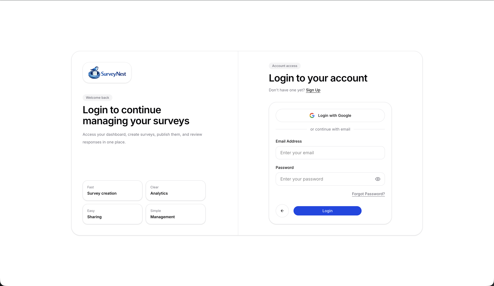
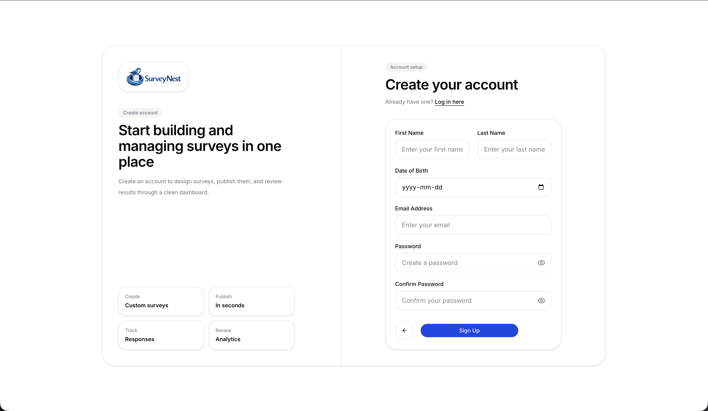
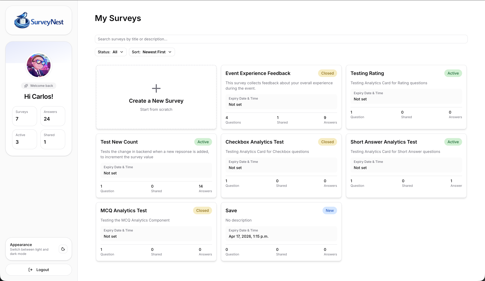
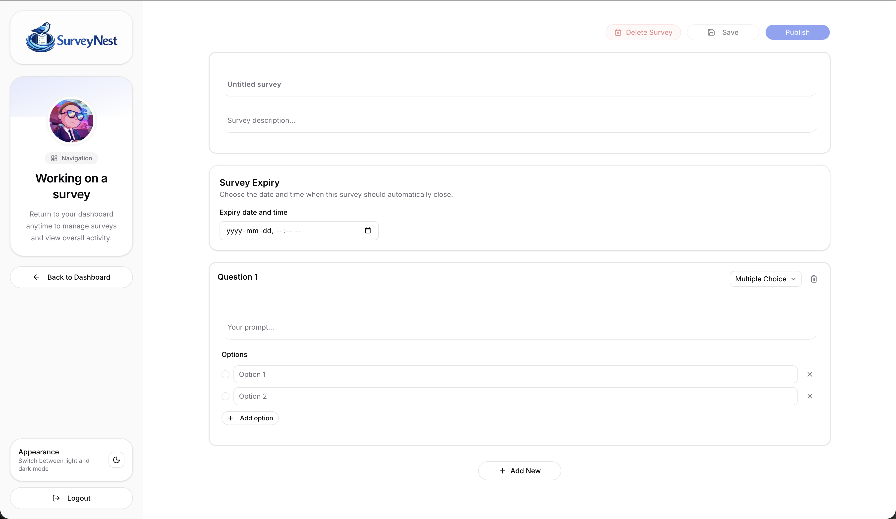
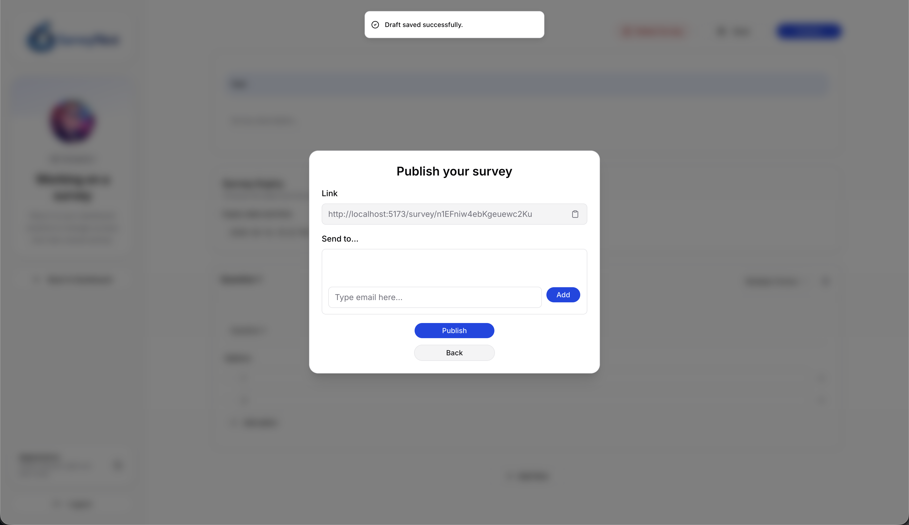
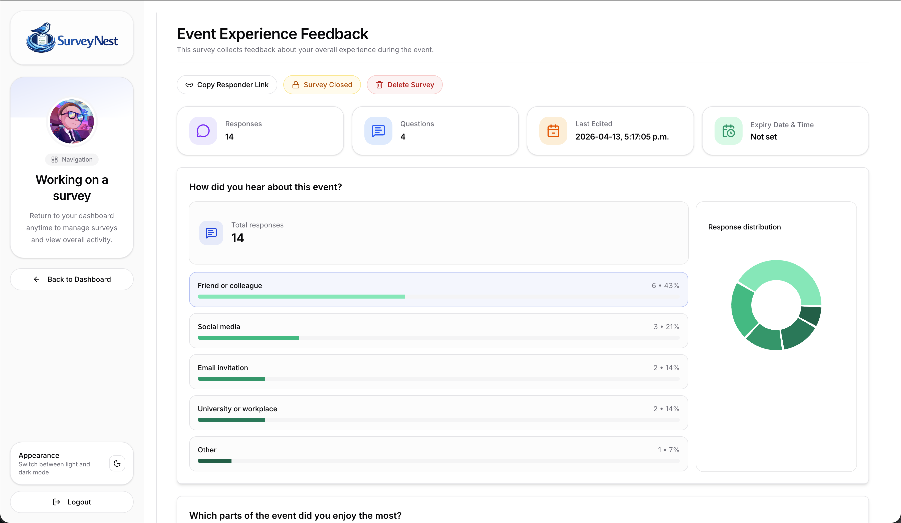
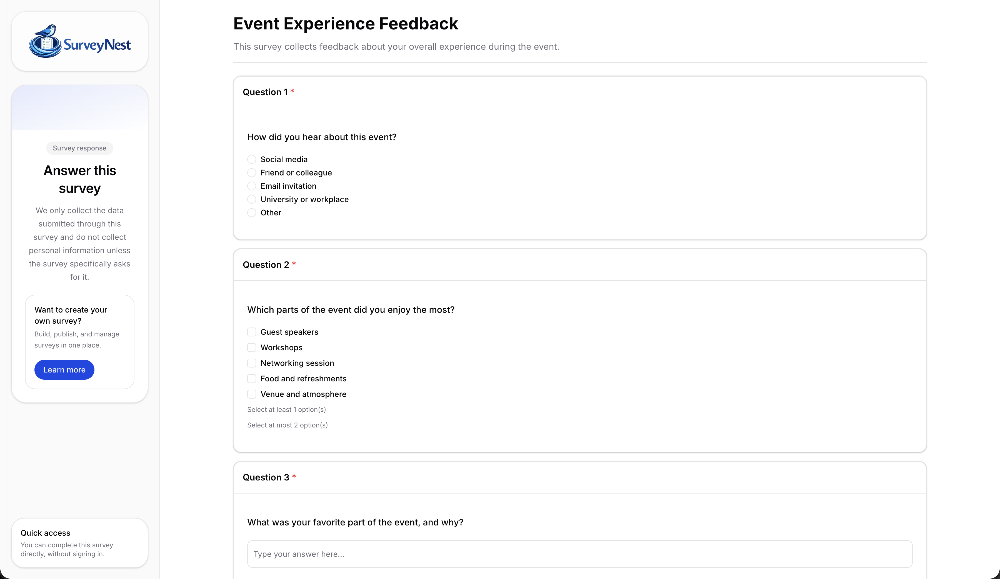
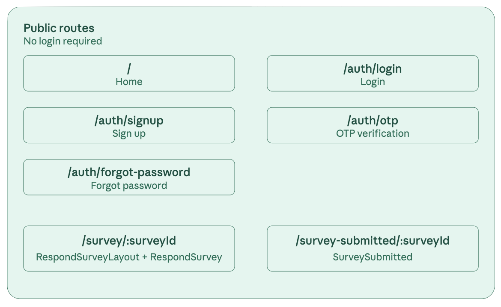
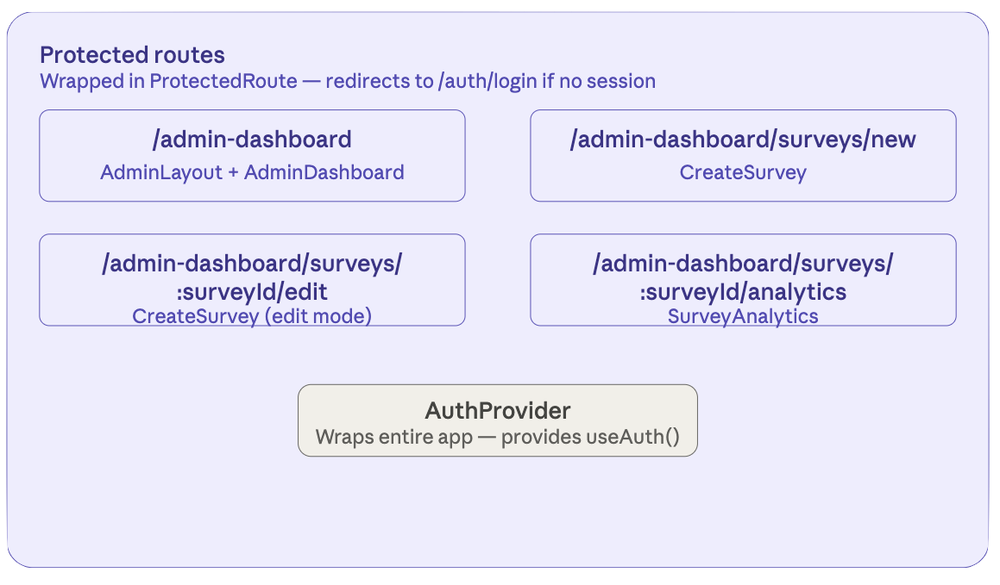

# Survey Project

A survey application system with separated frontend and backend architecture.


## Live Demo

Deployed application: [SurveyNest](https://survey-dfe77.web.app)

## App Preview











## Project Structure

```
Survey/
├── backend/          # Backend service (Node.js + Express + TypeScript)
├── frontend/         # Frontend application (React + Vite + TypeScript)
├── shared/           # Shared TypeScript DTOs/contracts
└── README.md
```

## Tech Stack

### Backend

- Node.js
- Express.js
- TypeScript
- tsx (Development runtime)

### Frontend

- React
- Vite
- TypeScript
- Tailwind CSS
- shadcn/ui
- Lucide React
- tw-animate-css

## Getting Started

### Install Dependencies

```bash
# Install backend dependencies
cd backend
npm install

# Install frontend dependencies
cd ../frontend
npm install
```

### Development Mode

**Start backend server:**

```bash
cd backend
npm run dev
```

Server runs on http://localhost:3000 by default

**Start frontend server:**

```bash
cd frontend
npm run dev
```

Server runs on http://localhost:5173 by default

### Production Build

**Build backend:**

```bash
cd backend
npm run build
npm start
```

**Build frontend:**

```bash
cd frontend
npm run build
```

## Development Guide

1. Install dependencies after cloning the repository
2. Backend and frontend need to be started separately
3. Ensure backend service is started first
4. Make sure type checking passes before committing code
5. The frontend uses Tailwind CSS and shadcn/ui for styling and reusable UI components
6. Shared theme variables are defined in `frontend/src/index.css`
7. Prefer Lucide icons for consistent icon usage
8. Reuse shared DTOs from the root `shared/` directory to maintain consistency between frontend and backend

## Shared DTOs

- We use a shared TypeScript DTO contract in the root `shared/` directory to maintain consistency between frontend and backend.


### Enums
- `QuestionType` → `MultipleChoice` | `CheckBox` | `ShortAnswer` | `Rating`
- `SurveyStatus` → `active` | `closed`

### DTOs
- `SurveyDTO` → stores survey-level metadata such as id, author, title, description, status, timestamps, and question count

- `QuestionBaseDTO` → defines the common structure shared by all question types

- `QuestionDTO` → discriminated union of all supported question DTOs
    - `MultipleChoiceDTO` 
    - `CheckBoxDTO` 
    - `ShortAnswerDTO`
    - `RatingDTO`

- `ResponseDTO` → stores one submitted survey response for a specific survey
    - `surveyId`
    - `submittedAt`
    - `answers: Record<string, AnswerValue>` where each key is the `questionId`

- `AnswerValue` → typed answer union matched to each question type
    - `MultipleChoice` → `string`
    - `CheckBox` → `string[]`
    - `ShortAnswer` → `string`
    - `Rating` → `number`


## Routes

The app uses React Router with two access tiers. The entire app is wrapped in AuthProvider (Firebase onAuthStateChanged) so any route can call useAuth(). Protected routes are wrapped in ProtectedRoute, which redirects to /auth/login if there is no active session.

### Public routes
No login required




### Protected routes
Require an active Firebase session. Redirect to /auth/login otherwise.

All nested under AdminLayout (shared sidebar + navbar via <Outlet>).



## License

ISC
