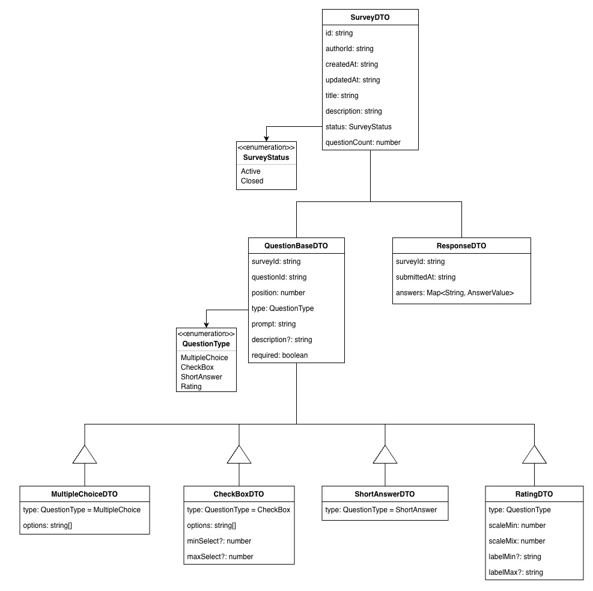

# Survey Project

A survey application system with separated frontend and backend architecture.

## Project Structure

```
Survey/
├── backend/          # Backend service (Node.js + Express + TypeScript)
├── frontend/         # Frontend application (React + Vite + TypeScript)
└── README.md
```

## Tech Stack

### Backend

- Node.js
- Express.js
- TypeScript
- tsx (Development runtime)

### Frontend

- React
- Vite
- TypeScript

## Getting Started

### Install Dependencies

```bash
# Install backend dependencies
cd backend
npm install

# Install frontend dependencies
cd ../frontend
npm install
```

### Development Mode

**Start backend server:**

```bash
cd backend
npm run dev
```

Server runs on http://localhost:3000 by default

**Start frontend server:**

```bash
cd frontend
npm run dev
```

Server runs on http://localhost:5173 by default

### Production Build

**Build backend:**

```bash
cd backend
npm run build
npm start
```

**Build frontend:**

```bash
cd frontend
npm run build
```

## API Endpoints

- `GET /` - Service information
- `GET /health` - Health check

## Development Guide

1. Install dependencies after cloning the repository
2. Backend and frontend need to be started separately
3. Ensure backend service is started first
4. Make sure type checking passes before committing code

## Shared DTOs

We use a shared TypeScript DTO contract to maintain consistency between frontend and backend.



- **Enums**
    - `QuestionType` → `MultipleChoice` | `CheckBox` | `ShortAnswer` | `Rating`
    - `SurveyStatus` → `active` | `closed`

- **DTOs**
    - `SurveyDTO` → stores survey-level metadata such as id, author, title, description, status, timestamps, and question count

    - `QuestionBaseDTO` → defines the common structure shared by all question types
        - `surveyId`
        - `questionId`
        - `position`
        - `type`
        - `prompt`
        - `description?`
        - `required`

    - `QuestionDTO` → discriminated union of all supported question DTOs
        - `MultipleChoiceDTO` → single-choice question with `options: string[]`
        - `CheckBoxDTO` → multi-select question with `options: string[]`, plus optional `minSelect` and `maxSelect`
        - `ShortAnswerDTO` → open-text question
        - `RatingDTO` → numeric scale question with `scaleMin`, `scaleMax`, and optional `labelMin` / `labelMax`

    - `ResponseDTO` → stores one submitted survey response
        - `surveyId`
        - `submittedAt`
        - `answers: Record<string, AnswerValue>` where each key is the exact `questionId`

    - `AnswerValue` → typed answer union matched to each question type
        - `MultipleChoice` → `string`
        - `CheckBox` → `string[]`
        - `ShortAnswer` → `string`
        - `Rating` → `number`

## License

ISC
